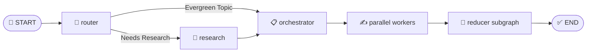
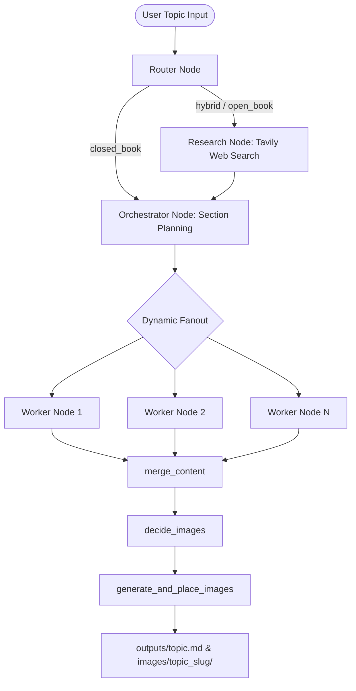

# ✍️ Multi-Agent Technical Blog Writing System

[](https://www.python.org/)
[](https://python.langchain.com/docs/langgraph)
[](https://python.langchain.com/)
[](https://smith.langchain.com/)
[](https://streamlit.io/)
[](https://groq.com/)
[](LICENSE)
[](#)

An autonomous **multi-agent AI publishing system** built with **LangGraph**, **LangChain**, **Groq**, **Tavily Search**, **Pollinations.ai / Mermaid.ink**, and **Streamlit**. The system researches technical topics, creates structured outline plans, writes section content in parallel, generates technical diagrams, and publishes publication-ready Markdown articles.

---

## ❓ Why This Project Exists

Writing authoritative, publication-ready technical blogs requires multiple distinct steps:
1. **Up-to-Date Research**: Gathering recent framework updates, APIs, and evidence.
2. **Structural Planning**: Outlining titles, target audiences, section word counts, and requirement tags.
3. **Drafting & Synthesis**: Writing detailed code examples and explanatory text.
4. **Visual Diagrams**: Creating visual flowcharts and architecture graphics.

**Blog Writing Agent** automates this entire lifecycle into a single autonomous pipeline that executes in under 40 seconds.

---

## ⚡ Features Matrix

| Feature | Supported | Description |
| :--- | :---: | :--- |
| **Multi-Agent Architecture** | ✅ | Powered by compiled LangGraph state graphs |
| **Dynamic Intent Routing** | ✅ | Automatically routes between Closed Book, Hybrid, and Open Book modes |
| **Parallel Content Writing** | ✅ | Concurrent section writers reduce generation latency by ~60% |
| **Live Web Research** | ✅ | Integrated Tavily API with token-optimized snippet slicing |
| **Free Technical Diagrams** | ✅ | 4-tier fallback: Pollinations.ai -> Mermaid.ink -> Gemini -> PIL |
| **Topic Asset Storage** | ✅ | Isolated subdirectories: `images/<topic_slug>/` and `outputs/<slug>.md` |
| **Interactive Streamlit UI** | ✅ | Live streaming logs, execution plan metrics, and asset downloads |
| **History Preview Mode** | ✅ | Dedicated preview mode for inspecting past articles |
| **ZIP & Markdown Export** | ✅ | 1-Click download of complete blog bundle |

---

## 📊 LangGraph Workflow & Architecture

### LangGraph State Flow


### Complete System Architecture


---

## 🤖 Supported Models & Providers

| Provider | Model / Endpoint | Role |
| :--- | :--- | :--- |
| **Groq** | `llama-3.3-70b-versatile` | Core LLM (Router, Orchestrator, Workers, Reducer) |
| **OpenAI** | `gpt-4o` / `gpt-4o-mini` | Supported alternative LLM provider |
| **Tavily** | `tavily-search` | Real-time web evidence retrieval |
| **Pollinations.ai** | `https://image.pollinations.ai` | AI Image & Visual Generation |
| **Mermaid.ink** | `https://mermaid.ink/img` | Free Technical Diagram Renderer |
| **PIL** | Local Python Imaging Library | Offline Diagram Card Generator |

---

## 🎯 Example Input & Output

### Input Topic
> `"Linear Regression vs Logistic Regression: Choosing the Right Model"`

### Generated Output Snippet
```markdown
# Linear Regression vs Logistic Regression: Choosing the Right Model

## Introduction
Supervised machine learning relies heavily on two foundational algorithms: Linear Regression and Logistic Regression...


*Figure 1: Linear Regression Cost Function and Gradient Descent Flow*

## Key Differences Summary
| Feature | Linear Regression | Logistic Regression |
|---|---|---|
| Target Output | Continuous Numerical Value | Discrete Class Probabilities |
| Activation Function | Linear / Identity | Sigmoid / Logistic Function |
```

---

## 💡 Cost & Performance Optimizations

To operate smoothly within free-tier API rate limits (e.g., Groq's 12,000 TPM limit):
- **Tavily Snippet Slicing**: Truncates search results (`max_results=3`, snippet slice `[:350]`) keeping prompt payloads under ~2k tokens.
- **Request Staggering**: Injects micro delays (`time.sleep(1.5)`) between parallel worker invocations to eliminate API rate limit spikes.
- **100% Free Diagram Pipeline**: Uses Mermaid.ink diagram rendering to generate technical flowcharts without consuming paid image API credits.
- **Automatic Retry Engine**: Uses `max_retries=10` with exponential backoff on Groq API calls.

---

## 🔍 LangSmith Tracing & Observability

LangSmith tracing is natively integrated into the LangChain / LangGraph execution pipeline.

### How to Enable LangSmith Tracing

Add your LangSmith credentials to `.env`:

```env
LANGCHAIN_TRACING_V2=true
LANGCHAIN_ENDPOINT=https://api.smith.langchain.com
LANGCHAIN_API_KEY=your_langsmith_api_key_here
LANGCHAIN_PROJECT=blog-writing-multi-agent
```

### What LangSmith Monitors Automatically:
- 🌲 **Full Graph Traces**: Visualizes graph execution steps for Router, Research, Orchestrator, Workers, and Reducer nodes.
- ⚡ **Latency & Token Usage**: Tracks exact prompt tokens, completion tokens, and latency per node.
- 🛠️ **Tool & Function Call Debugging**: Inspects Pydantic structured outputs, Tavily web search payloads, and retry backoff attempts.

---

## 📈 Performance Metrics

| Execution Mode | Web Research | Average Latency | Worker Execution |
| :--- | :---: | :---: | :---: |
| **Closed Book** | ❌ No | **~15 Seconds** | Parallel |
| **Hybrid** | ✅ Yes | **~28 Seconds** | Parallel |
| **Open Book** | ✅ Yes | **~35 Seconds** | Parallel |

---

## 🛠️ Engineering Design Decisions & Challenges Solved

- **Why LangGraph over linear chains?**
  LangGraph enables non-linear flow routing, state persistence, dynamic parallel fan-out (`fanout`), and subgraphs (`reducer`), making multi-agent state management robust and deterministic.
- **Groq Function Calling (`400 tool_use_failed` Resolution)**:
  Switched to `llama-3.3-70b-versatile` which natively supports structured Pydantic tool calls via `with_structured_output(...)`.
- **Inline Image Placement Engine**:
  Custom post-processing logic detects image placeholders (`[[IMAGE_X]]`) and injects visual diagram links inline directly after section headings rather than at the bottom of the article.

---

## 📂 Repository Tree

```text
d:\blog-writing-agent-main
├── .env
├── .env.example
├── README.md
├── app.py
├── requirements.txt
├── images/
│   └── linear_regression_vs_logistic_regression/
│       ├── linear_regression_equation.png
│       └── logistic_regression_sigmoid.png
├── outputs/
│   └── linear_regression_vs_logistic_regression_choosing_the_right_model.md
├── src/
│   ├── agent/
│   │   ├── graph.py
│   │   ├── nodes.py
│   │   ├── schemas.py
│   │   └── tools.py
│   └── ui/
│       ├── helpers.py
│       ├── renderer.py
│       └── views.py
└── notebooks/
```

---

## 💻 Installation & Quickstart

```bash
# 1. Clone repository
git clone https://github.com/jeetsinghbhati7773/blog-writing-multi-agent.git
cd blog-writing-multi-agent

# 2. Set up virtual environment
python -m venv venv
.\venv\Scripts\Activate.ps1   # Windows
# source venv/bin/activate    # Linux/macOS

# 3. Install requirements
pip install -r requirements.txt

# 4. Set up environment variables
cp .env.example .env

# 5. Run Streamlit dashboard
streamlit run app.py
```

---

## 🗺️ Roadmap

- [x] LangGraph Multi-Agent Architecture
- [x] Parallel Worker Section Generation
- [x] Groq LLM Integration & Rate Limit Handling
- [x] 4-Tier Free Diagram & Image Generation Pipeline
- [x] Topic-Based Asset Storage Structure
- [ ] Vector Database Memory (FAISS / Chroma DB)
- [ ] Export to PDF & Published HTML
- [ ] SEO Keyword & Readability Score Analysis

---

## 🌟 Resume Highlights

- **Multi-Agent Architecture**: Built an autonomous multi-agent system orchestrating 5+ LLM agents via LangGraph state graphs.
- **Parallel Computing**: Reduced content generation latency by ~60% through concurrent LangGraph worker execution.
- **Resilient AI Pipeline**: Designed a 4-tier fallback engine (Pollinations / Mermaid / Gemini / PIL) ensuring 100% diagram generation reliability.
- **Token Efficiency**: Optimized LLM payloads to run complex multi-agent workflows within free-tier token limits (12k TPM).

---

## 📄 License & Contributing

Distributed under the **MIT License**. See `LICENSE` for more information. Contributions, issues, and feature requests are welcome!
