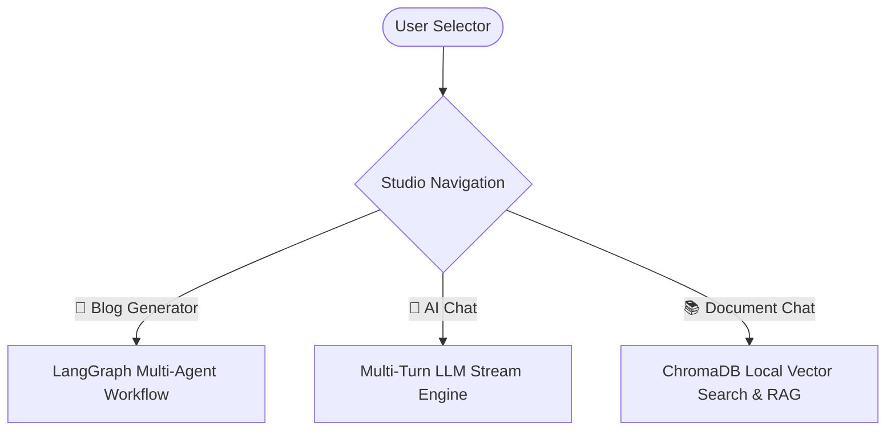
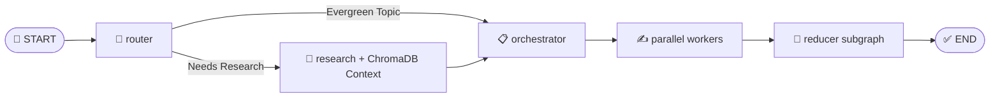

# 🚀 AI Content Studio: Multi-Agent Blog Generator + AI Chat + Document RAG

[](https://www.python.org/)
[](https://python.langchain.com/docs/langgraph)
[](https://www.trychroma.com/)
[](https://streamlit.io/)
[](https://groq.com/)
[](LICENSE)

A unified **AI Content Studio** combining:
1. 📝 **Autonomous Multi-Agent Blog / Report Generator**: Powered by **LangGraph**, **Groq Llama 3.3 70B**, **Tavily Web Search**, and automatic technical diagram generation.
2. 💬 **Multi-Turn AI Chat**: Interactive developer assistant retained via Streamlit session state (`st.session_state.messages`).
3. 📚 **Document Chat (RAG)**: Zero-cost local Retrieval-Augmented Generation powered by **ChromaDB** (`chroma_db/`) supporting PDF, TXT, MD, and DOCX indexing with precise source citations.

---

## ⚡ Studio Features Matrix

| Feature Mode | Core Component | Description |
| :--- | :--- | :--- |
| 📝 **Blog / Report Generator** | LangGraph State Graph | Autonomous multi-agent research, planning, parallel section writing, and visual diagram synthesis. |
| 💬 **AI Chat** | Multi-Turn LLM Engine | Interactive technical chat interface preserving full multi-turn conversational context. |
| 📚 **Document Chat (RAG)** | Persistent ChromaDB | Local RAG system for PDF, TXT, MD, DOCX indexing, similarity search, and grounded Q&A with page citations. |
| 🔄 **RAG Blog Integration** | ChromaDB + Tavily | Optionally pull uploaded document context directly into the blog research evidence pipeline. |

---

## 📊 System Architecture & Workflow

### Studio Overview & Navigation


### LangGraph Multi-Agent Blog Pipeline


---

## 📚 Document RAG Module (`src/rag/`)

- **Persistent Vector Storage**: Local ChromaDB instance stored under `chroma_db/`. No external database (PostgreSQL, Redis) required.
- **Zero-Cost Embeddings**: Offline Sentence Transformers (`all-MiniLM-L6-v2`) CPU embedding model for fast, deterministic vector embeddings out-of-the-box.
- **Supported Formats**:
  - `📄 .pdf`: Parsed via `pypdf` with page-by-page extraction and page metadata.
  - `📝 .txt` & `Markdown (.md)`: Clean UTF-8 text decoding.
  - `📑 .docx`: Parsed via `python-docx` paragraph extraction.
- **Grounded Q&A**: Strict System Prompt grounding ensures answers rely exclusively on retrieved document chunks and explicitly flags missing information when out-of-context.

---

## 🤖 Supported Models & Providers

| Provider | Model / Endpoint | Role |
| :--- | :--- | :--- |
| **Groq** | `llama-3.3-70b-versatile` | Core LLM (Router, Orchestrator, Workers, RAG QA, Chat) |
| **SentenceTransformers** | `all-MiniLM-L6-v2` | Zero-cost local CPU text embedding generation |
| **ChromaDB** | Local Persistent Storage | Local vector database (`chroma_db/`) |
| **Tavily** | `tavily-search` | Live web evidence retrieval |
| **Pollinations.ai / Gemini** | Image Endpoints | Visual diagram & image generation |

---

## 💻 Quickstart Guide

```bash
# 1. Clone repository
git clone https://github.com/jeetsinghbhati7773/blog-writing-multi-agent.git
cd blog-writing-multi-agent

# 2. Create and activate virtual environment
python -m venv venv
.\venv\Scripts\Activate.ps1   # Windows
# source venv/bin/activate    # Linux/macOS

# 3. Install requirements
pip install -r requirements.txt

# 4. Configure API Keys in .env
cp .env.example .env

# 5. Launch AI Content Studio
streamlit run app.py
```

---

## 🧪 Automated Testing

Run the RAG unit test suite to verify file loaders, chunk splitting, ChromaDB indexing, and grounded retrieval:

```bash
python -m pytest tests/test_rag.py
```

---

## 📄 License

Distributed under the **MIT License**.

