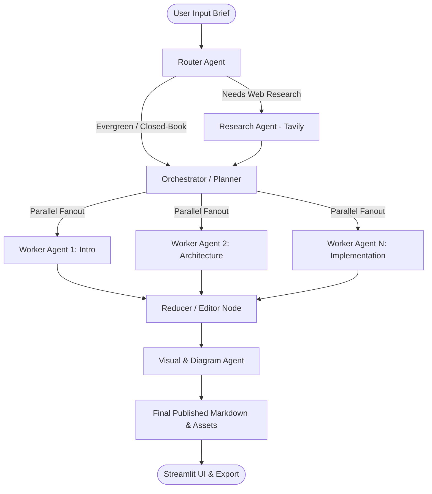

# AI Blog Writing Agent — Multi-Agent Content Generation with LangGraph

[](https://www.python.org/downloads/)
[](https://github.com/langchain-ai/langgraph)
[](https://www.langchain.com/)
[](https://streamlit.io/)

An autonomous, multi-agent AI system designed to research, plan, draft, assemble, edit, and generate technical diagrams for comprehensive, production-grade technical blog articles. Built with **LangGraph**, **LangChain**, **Groq LLM**, and **Tavily Web Search**.

---

## 💡 Problem Statement

Writing deep technical blog posts requires significant manual effort: conducting web research, organizing structured outlines, drafting individual sections, ensuring smooth logical flow, avoiding repetition, and generating architecture diagrams. Single-prompt LLM generation often leads to hallucinations, repetitive prose, shallow coverage, and token context overflow on long articles.

## 🚀 Solution

**AI Blog Writing Agent** solves this by breaking the writing process down into a specialized graph of multi-agent state nodes:

1. **Router Agent**: Dynamically evaluates the user's prompt to determine if external web research is required.
2. **Research Agent**: Executes query fanout via Tavily, collecting structured real-time research and evidence.
3. **Orchestrator / Planner**: Generates a granular, topic-specific article outline with section constraints and target word counts.
4. **Parallel Worker Agents**: Uses LangGraph parallel fanout (`Send`) to concurrently write high-quality section drafts in parallel.
5. **Reducer / Editor**: Merges individual section drafts, harmonizes transitions, eliminates redundancy, and checks tone consistency.
6. **Visual / Diagram Agent**: Analyzes technical content to dynamically generate clean Mermaid diagrams and visual assets.

---

## 🏗 System Architecture & Workflow



---

## 🌟 Key Features

- **Autonomous Graph Execution**: Fully stateful execution loop managed by `langgraph.graph.StateGraph`.
- **Intelligent Routing**: Avoids unnecessary web searches for closed-book evergreen topics while fetching fresh, live facts for technical or news topics.
- **Parallel Worker Fanout**: Concurrently generates article sections using LangGraph's dynamic `Send` pattern, drastically reducing end-to-end generation latency.
- **Resilient Retry & Backoff**: Exponential backoff wrapper handling API rate limits (Groq 429/TPM limits) and JSON structured output parsing failures.
- **Structured Pydantic Schemas**: Strict data validation for routing decisions, article plans, research evidence packs, and visual image specifications.
- **Dynamic Technical Diagrams**: Automatically injects Mermaid architecture flowcharts and visual diagrams into technical posts.
- **Interactive Streamlit Workspace**: Features a structured Content Brief form, real-time agent workflow status indicators, live streaming run logs, and one-click markdown/bundle export.

---

## 📂 Project Structure

```
ai-blog-writing-agent/
├── app.py                     # Main Streamlit application entry point
├── requirements.txt           # Python dependencies
├── .env.example               # Environment variable placeholders
├── .gitignore                 # Git ignore rules
├── README.md                  # Project documentation
│
├── src/
│   ├── agent/
│   │   ├── graph.py           # LangGraph StateGraph assembly & compilation
│   │   ├── nodes.py           # Router, Research, Orchestrator, Worker, Reducer, Visual nodes
│   │   ├── rate_limiter.py    # Request rate limiter for LLM calls
│   │   ├── schemas.py         # Pydantic models & LangGraph TypedDict State
│   │   └── tools.py           # Tavily web search & diagram generation tools
│   │
│   ├── paths.py               # Output & image filesystem path helpers
│   │
│   └── ui/
│       ├── components.py      # Streamlit header, content brief, progress bar, sidebar
│       ├── helpers.py         # Streaming utilities & past blog loaders
│       ├── renderer.py        # Markdown & diagram rendering engine
│       ├── theme.py           # Custom CSS styling tokens
│       └── views.py           # Article workspace & past library archive views
│
└── tests/
    └── test_agent.py          # Unit tests for router, worker, reducer & tools
```

---

## 🛠 Technology Stack

- **Framework**: LangGraph, LangChain Core
- **LLM Provider**: Groq (`llama-3.3-70b-versatile` / `qwen-2.5-32b`) / ChatOpenAI fallback
- **Web Search**: Tavily Search API
- **Data Validation**: Pydantic v2, TypedDict
- **User Interface**: Streamlit
- **Diagrams & Visuals**: Mermaid.js, Pollinations AI, Google Gemini API

---

## ⚡ Quickstart Guide

### 1. Prerequisites
- Python 3.10 or higher installed
- Free API keys from [Groq Console](https://console.groq.com/keys) and [Tavily](https://tavily.com)

### 2. Installation

```bash
# Clone repository
git clone https://github.com/jeetsinghbhati7773/blog-writing-multi-agent.git
cd blog-writing-multi-agent

# Create virtual environment
python -m venv venv

# Activate virtual environment (Windows PowerShell)
.\venv\Scripts\Activate.ps1

# Install dependencies
pip install -r requirements.txt
```

### 3. Environment Setup

Copy `.env.example` to `.env` and fill in your API keys:

```bash
cp .env.example .env
```

`.env` configuration:
```env
GROQ_API_KEY=your_groq_api_key_here
GROQ_MODEL=llama-3.3-70b-versatile
TAVILY_API_KEY=your_tavily_api_key_here
```

### 4. Running the Application

```bash
streamlit run app.py
```

Open your browser at `http://localhost:8501`.

---

## 🧪 Testing

Run the automated test suite with `pytest`:

```bash
pytest tests/
```

---

## 📌 Limitations & Future Improvements

- **Export Formats**: Currently supports Markdown and Zip bundle exports; PDF/HTML export support is planned.
- **Multilingual Generation**: Optimizations for non-English technical drafting can be added in future graph nodes.
