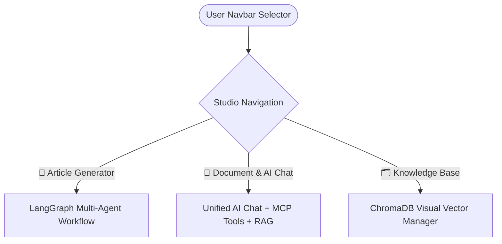
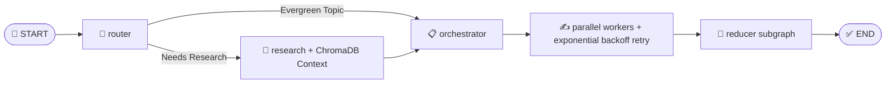

# 🚀 AI Content Studio: Multi-Agent Blog Generator + MCP Tools + Document RAG

[](https://www.python.org/)
[](https://python.langchain.com/docs/langgraph)
[](https://www.trychroma.com/)
[](https://modelcontextprotocol.io/)
[](https://streamlit.io/)
[](https://groq.com/)
[](LICENSE)

A unified **AI Content Studio** combining:
1. 📝 **Autonomous Multi-Agent Blog Generator**: Powered by **LangGraph**, **Groq** (`openai/gpt-oss-120b`), **Tavily Web Search**, exponential rate-limit retry logic, and technical diagram synthesis.
2. 🤖 **General AI Chat + MCP Server Tools**: Interactive multi-turn assistant with built-in Model Context Protocol (MCP) server tools (`add_expense`, `list_expenses`, `summarize`), live stock prices (`get_stock_price`), and web search (`duckduckgo_search`).
3. 📚 **Document Intelligence (RAG)**: Zero-cost local Retrieval-Augmented Generation powered by **ChromaDB** with real-time visual 3-step pipeline progress (Extraction 📄 ➔ Chunking ✂️ ➔ Embedding & Vector Ingestion 🧠).

---

## ⚡ Studio Features Matrix

| Feature Mode | Core Component | Description |
| :--- | :--- | :--- |
| 📝 **Blog Generator** | LangGraph State Graph | Autonomous multi-agent research, planning, parallel section writing with Groq rate-limit staggering, and visual diagrams. |
| 🤖 **General AI Chat** | Multi-Turn LLM + MCP Tools | Interactive chat automatically bound with MCP server tools (Expenses, Stocks, Web Search) with concise single-sentence action synthesis. |
| 📚 **Strict Document RAG** | Persistent ChromaDB | Answers strictly grounded in uploaded PDF/TXT/MD/DOCX document chunks with page citations and zero external hallucination. |
| 🔀 **Hybrid Mode** | ChromaDB + Web Evidence | Combines uploaded document context with external search & general AI technical knowledge. |
| 🗂 **Knowledge Base Manager** | Live 3-Step RAG Pipeline | Visual progress tracking for page text extraction, 1000-char semantic chunking, and 384-dim dense vector embedding ingestion (`all-MiniLM-L6-v2`). |

---

## 📊 System Architecture & Workflow

### Studio Navigation


### LangGraph Multi-Agent Blog Pipeline


---

## 🛠️ MCP (Model Context Protocol) Integration

The assistant connects to external remote and local MCP tool providers:

- **Remote FastMCP Server**: HTTP/SSE endpoint (`https://splendid-gold-dingo.fastmcp.app/mcp`) for expense tracking (`add_expense`, `list_expenses`, `summarize`).
- **Stock Price Tool**: Real-time financial quotes via Alpha Vantage (`get_stock_price`).
- **DuckDuckGo Web Search**: Live search results (`duckduckgo_search`).
- **Universal Sync/Async Executor**: Wraps async `StructuredTool` instances (`execute_tool`) seamlessly on a dedicated background event loop.

---

## 📚 Document RAG Module (`src/rag/`)

- **Persistent Vector Storage**: Local SQLite-backed ChromaDB store under `chroma_db/`. No external database required.
- **Zero-Cost Embeddings**: Offline Sentence Transformers (`all-MiniLM-L6-v2`) CPU embedding model for fast 384-dimensional vector embeddings out-of-the-box.
- **Visual Indexing Pipeline**: Real-time 3-step status and progress bar:
  1. 📄 **Page & Text Extraction** (`pypdf`, `python-docx`)
  2. ✂️ **Semantic Chunking** (1,000 chars, 150 overlap)
  3. 🧠 **Dense Vector Embedding & Storage** (ChromaDB)

---

## 🤖 Supported Models & Providers

| Provider | Model / Endpoint | Role |
| :--- | :--- | :--- |
| **Groq** | `openai/gpt-oss-120b` / `qwen/qwen3.6-27b` | Core LLM (Router, Orchestrator, Workers, MCP Tool Binding, RAG QA) |
| **MCP Client** | `FastMCP HTTP Stream` | Remote & local MCP tool invocation |
| **SentenceTransformers** | `all-MiniLM-L6-v2` | Zero-cost local CPU text embedding generation |
| **ChromaDB** | Local Persistent SQLite | Vector database (`chroma_db/`) |
| **DuckDuckGo & Tavily** | `ddgs` & `tavily-search` | Live web evidence & score retrieval |

---

## 💻 Quickstart Guide

```bash
# 1. Clone repository
git clone https://github.com/jeetsinghbhati7773/blog-writing-multi-agent.git
cd blog-writing-multi-agent

# 2. Create and activate virtual environment
python -m venv venv
.\venv\Scripts\Activate.ps1   # Windows
# source venv/bin/activate    # Linux/macOS

# 3. Install requirements
pip install -r requirements.txt

# 4. Configure API Keys in .env
# Set GROQ_API_KEY, GROQ_MODEL="openai/gpt-oss-120b", TAVILY_API_KEY
cp .env.example .env

# 5. Launch AI Content Studio
streamlit run app.py
```

---

## 🧪 Automated Testing

Run the RAG unit test suite to verify file loaders, chunk splitting, ChromaDB indexing, and grounded retrieval:

```bash
python -m pytest tests/test_rag.py
```

---

## 📄 License

Distributed under the **MIT License**.
