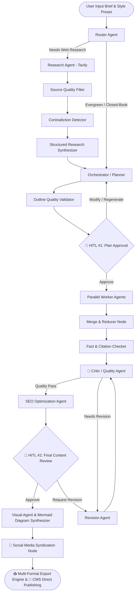

# AI Blog Writing Agent — Multi-Agent Content Generation with LangGraph & HITL

[](https://www.python.org/downloads/)
[](https://github.com/langchain-ai/langgraph)
[](https://www.langchain.com/)
[](https://streamlit.io/)
[](tests/test_agent.py)

An autonomous, multi-agent AI system designed to research, filter, plan, validate, draft, fact-check, edit, optimize SEO, generate visual assets & Mermaid.js diagrams, create derivative social media posts, and publish directly to CMS platforms. Features **Dual Human-in-the-Loop (HITL)** checkpoints for plan approval and final content review. Built with **LangGraph**, **LangChain**, **Groq LLM**, **Tavily Web Search**, and **Streamlit**.

---

## 💡 Problem Statement

Writing deep technical blog posts requires significant manual effort: conducting web research, filtering source authority, resolving conflicting claims, organizing structured outlines, drafting individual sections, ensuring factual accuracy, avoiding repetition, optimizing SEO, generating architecture diagrams, formatting social media threads, and publishing across CMS platforms. Single-prompt LLM generation often leads to hallucinations, repetitive prose, shallow coverage, and token context overflow on long articles.

---

## 🚀 Solution & Architecture

**AI Blog Writing Agent** solves this by orchestrating a specialized graph of multi-agent state nodes with human checkpoints:


```mermaid
flowchart TD
    Start([User Input Brief & Style Preset]) --> Router[Router Agent]
    
    Router -->|Needs Web Research| Research[Research Agent - Tavily]
    Router -->|Evergreen / Closed-Book| Orchestrator[Orchestrator / Planner]
    
    Research --> SourceFilter[Source Quality Filter]
    SourceFilter --> Contradiction[Contradiction Detector]
    Contradiction --> StructuredResearch[Structured Research Synthesizer]
    StructuredResearch --> Orchestrator
    
    Orchestrator --> OutlineValidator[Outline Quality Validator]
    OutlineValidator --> HITL1{🧑 HITL #1: Plan Approval}
    
    HITL1 -->|Approve| WorkerFanout[Parallel Worker Agents]
    HITL1 -->|Modify / Regenerate| Orchestrator
    
    WorkerFanout --> MergeContent[Merge & Reducer Node]
    MergeContent --> FactChecker[Fact & Citation Checker]
    FactChecker --> Critic[🧐 Critic / Quality Agent]
    
    Critic -->|Quality Pass| SEOAgent[SEO Optimization Agent]
    Critic -->|Needs Revision| Revision[Revision Agent] --> Critic
    
    SEOAgent --> HITL2{🧑 HITL #2: Final Content Review}
    
    HITL2 -->|Approve| Visual[Visual Agent & Mermaid Diagram Synthesizer]
    HITL2 -->|Request Revision| Revision
    
    Visual --> SocialSyndication[📢 Social Media Syndication Node]
    SocialSyndication --> ExportPublish([📥 Multi-Format Export Engine & 🚀 CMS Direct Publishing])
```

---

## 🌟 Key Features

1. **🧑 Dual Human-in-the-Loop (HITL) Checkpoints**:
   - **HITL Checkpoint #1 (Plan Review)**: Pauses execution after the Orchestrator & Outline Validator so you can review, modify, or regenerate the outline before section generation.
   - **HITL Checkpoint #2 (Final Content Review)**: Pauses after section workers, Critic, Fact Checker, and SEO Agent complete so you can inspect the full draft, SEO metadata, and fact check scores before publication.

2. **📢 Social Media Syndication Node**:
   - Automatically generates multi-channel derivative marketing content from the final article:
     - **Twitter/X Thread**: 5–7 tweets (<= 280 chars) with hooks, key takeaways, hashtags, and CTAs.
     - **LinkedIn Post**: Formatted post with bold headlines, emojis, bullet points, and CTAs.
     - **Email Newsletter Digest**: 200–300 word executive summary tailored for tech subscribers.

3. **📊 Mermaid.js System Diagram Generator**:
   - Analyzes article architecture and process flows to synthesize clean, valid `mermaid` code blocks (`flowchart TD`, `sequenceDiagram`, `architecture`) embedded seamlessly into markdown headers.

4. **📥 Multi-Format Export Engine**:
   - Download finished posts and metadata in multiple formats:
     - **Hugo/Jekyll YAML Frontmatter Markdown (`.md`)** with meta titles, tags, and descriptions.
     - **Standalone Styled HTML (`.html`)** with modern typography layout CSS.
     - **Full Payload Report (`.json`)** serializing article, SEO plan, fact-check audit, and social assets.
     - **Complete Asset ZIP Package (`.zip`)**.

5. **🚀 Webhook & CMS Direct Publishing**:
   - Direct one-click publishing of drafts/posts to **Dev.to API** (`https://dev.to/api/articles`).
   - Custom **CMS Webhook trigger** sending POST payloads to platforms like Strapi, WordPress, Zapier, or Make.

6. **🧐 Autonomous Critic & Quality Audit Loop**:
   - Evaluates drafts across 7 quality dimensions (*factual consistency, relevance, completeness, readability, repetition, structure, grounding*).
   - Automatically triggers a `revision_node` loop if quality score is below threshold (< 7.5 / 10).

7. **🛡️ Fact & Citation Grounding Checker**:
   - Cross-references draft claims against retrieved research evidence sources, calculating a 0–10 factual grounding score and claim verification table.

8. **🔎 Source Quality Filter & Contradiction Detector**:
   - `source_filter_node`: Scores search results by authority, relevance, freshness, and deduplication before planning.
   - `contradiction_detector_node`: Identifies conflicting claims across web sources and provides resolution guidance to the Orchestrator.

9. **🎨 6 Article Style Profiles**:
   - Selectable writing presets (`Technical Tutorial`, `Beginner Friendly`, `Research Style`, `Developer Blog`, `LinkedIn Post`, `SEO Blog`) driving Planner & Worker prompts.

10. **🎯 SEO Optimization Agent**:
    - Generates meta titles, meta descriptions, primary/secondary keywords, clean URL slugs, readability levels, and FAQ sections.

11. **⚡ Smart Parallel Worker Fanout**:
    - Concurrently generates article sections using LangGraph's dynamic `Send` pattern, with shared rate limiting (`groq_rate_limiter`) to avoid API rate spikes.

12. **📊 Offline Evaluation Benchmark Suite**:
    - Standalone evaluation framework (`tests/eval_benchmark.py`) assessing Relevance, Completeness, Citation Coverage, Word Target Adherence, and Execution Latency across test datasets.

---

## 📂 Project Structure

```
ai-blog-writing-agent/
├── app.py                     # Main Streamlit application entry point
├── requirements.txt           # Python dependencies
├── pytest.ini                 # Pytest configuration
├── .env.example               # Environment variable placeholders
├── README.md                  # Project documentation
│
├── src/
│   ├── agent/
│   │   ├── graph.py           # LangGraph StateGraph assembly & compilation
│   │   ├── nodes.py           # Router, Research, Filter, Contradiction, Orchestrator, HITL, Worker, Reducer, FactChecker, Critic, SEO, Visual & Mermaid, Social Syndication nodes
│   │   ├── rate_limiter.py    # Request rate limiter for LLM calls
│   │   ├── schemas.py         # Pydantic models (SocialPosts, SEOPlan, etc.) & TypedDict State
│   │   └── tools.py           # Tavily search, image generation, Dev.to & Webhook publishing tools
│   │
│   ├── paths.py               # Output & image filesystem path helpers
│   │
│   └── ui/
│       ├── components.py      # Streamlit header, content brief, progress bar, dual HITL review cards
│       ├── helpers.py         # Streaming utilities, Markdown frontmatter, HTML, and JSON export helpers
│       ├── renderer.py        # Markdown & image rendering engine
│       ├── theme.py           # Custom CSS styling tokens
│       └── views.py           # Article workspace, Social tab, Publishing tab, SEO tab, FactCheck tab, Critic tab, and archive views
│
└── tests/
    ├── test_agent.py          # Complete unit test suite (32 test cases passed)
    └── eval_benchmark.py      # Offline evaluation benchmark suite
```

---

## 🛠 Technology Stack

- **Orchestration**: LangGraph (`StateGraph`, `MemorySaver`, `interrupt`, `Command`)
- **LLM Core**: Groq API (`llama-3.3-70b-versatile` / `qwen-2.5-32b`) / ChatOpenAI
- **Web Research**: Tavily Search API
- **Data Schemas**: Pydantic v2, TypedDict
- **User Interface**: Streamlit
- **Diagrams & Visuals**: Mermaid.js, Gemini API / Pollinations AI
- **Observability**: LangChain Tracing V2 (LangSmith)

---

## ⚡ Quickstart Guide

### 1. Prerequisites
- Python 3.10 or higher installed
- Free API keys from [Groq Console](https://console.groq.com/keys) and [Tavily](https://tavily.com)

### 2. Installation

```bash
# Clone repository
git clone https://github.com/jeetsinghbhati7773/blog-writing-multi-agent.git
cd blog-writing-multi-agent

# Create virtual environment
python -m venv venv

# Activate virtual environment (Windows PowerShell)
.\venv\Scripts\Activate.ps1

# Install dependencies
pip install -r requirements.txt
```

### 3. Environment Setup

Copy `.env.example` to `.env` and fill in your API keys:

```bash
cp .env.example .env
```

`.env` configuration:
```env
GROQ_API_KEY=your_groq_api_key_here
GROQ_MODEL=llama-3.3-70b-versatile
TAVILY_API_KEY=your_tavily_api_key_here
LANGCHAIN_TRACING_V2=true
LANGCHAIN_API_KEY=your_langsmith_key_optional
```

### 4. Running the Application

```bash
streamlit run app.py
```

Open your browser at `http://localhost:8501`.

---

## 🧪 Testing & Evaluation

### 1. Automated Unit Test Suite

Run the unit test suite covering router, research filter, contradiction detector, outline validator, critic loop, fact checker, SEO agent, and HITL interrupts:

```bash
pytest tests/test_agent.py -v
```

### 2. Offline Evaluation Benchmark Suite

Run the evaluation benchmark script:

```bash
python tests/eval_benchmark.py
```

Outputs composite quality, relevance, completeness, citation coverage, and latency metrics across test prompts.
