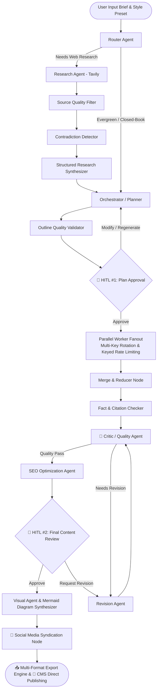

# AI Blog Writing Agent — Multi-Agent Content Generation with LangGraph & HITL

[](https://www.python.org/downloads/)
[](https://github.com/langchain-ai/langgraph)
[](https://www.langchain.com/)
[](https://streamlit.io/)
[](tests/test_agent.py)

An autonomous, multi-agent AI system designed to research, filter, plan, validate, draft, fact-check, edit, optimize SEO, generate visual assets & Mermaid.js diagrams, create derivative social media posts, and publish directly to CMS platforms.

Features **Dual Human-in-the-Loop (HITL)** checkpoints, **Multi-Account Groq Key Rotation** with slot-based rate limiting for high-throughput parallel drafting, and resilient self-healing token budget management. Built with **LangGraph**, **LangChain**, **Groq LLMs**, **Tavily Web Search**, and **Streamlit**.

---

## 💡 Problem Statement

Writing deep technical blog posts requires significant manual effort: conducting web research, filtering source authority, resolving conflicting claims, organizing structured outlines, drafting individual sections, ensuring factual accuracy, avoiding repetition, optimizing SEO, generating architecture diagrams, formatting social media threads, and publishing across CMS platforms.

Single-prompt LLM generation often leads to hallucinations, repetitive prose, shallow coverage, and token context overflow. Furthermore, parallel multi-agent section generation frequently exhausts free-tier LLM rate limits (429) or token-per-minute budgets (413).

---

## 🚀 Solution & Architecture

**AI Blog Writing Agent** solves this by orchestrating a specialized graph of multi-agent state nodes with human checkpoints, parallel worker fanout, and multi-key load balancing:


```mermaid
flowchart TD
    Start([User Input Brief & Style Preset]) --> Router[Router Agent]
    
    Router -->|Needs Web Research| Research[Research Agent - Tavily]
    Router -->|Evergreen / Closed-Book| Orchestrator[Orchestrator / Planner]
    
    Research --> SourceFilter[Source Quality Filter]
    SourceFilter --> Contradiction[Contradiction Detector]
    Contradiction --> StructuredResearch[Structured Research Synthesizer]
    StructuredResearch --> Orchestrator
    
    Orchestrator --> OutlineValidator[Outline Quality Validator]
    OutlineValidator --> HITL1{🧑 HITL #1: Plan Approval}
    
    HITL1 -->|Approve| WorkerFanout[Parallel Worker Fanout<br/>Multi-Key Rotation & Keyed Rate Limiting]
    HITL1 -->|Modify / Regenerate| Orchestrator
    
    WorkerFanout --> MergeContent[Merge & Reducer Node]
    MergeContent --> FactChecker[Fact & Citation Checker]
    FactChecker --> Critic[🧐 Critic / Quality Agent]
    
    Critic -->|Quality Pass| SEOAgent[SEO Optimization Agent]
    Critic -->|Needs Revision| Revision[Revision Agent] --> Critic
    
    SEOAgent --> HITL2{🧑 HITL #2: Final Content Review}
    
    HITL2 -->|Approve| Visual[Visual Agent & Mermaid Diagram Synthesizer]
    HITL2 -->|Request Revision| Revision
    
    Visual --> SocialSyndication[📢 Social Media Syndication Node]
    SocialSyndication --> ExportPublish([📥 Multi-Format Export Engine & 🚀 CMS Direct Publishing])
```

---

## 🌟 Key Features

### 1. 🔑 Multi-Account API Key Rotation & Slot-Based Rate Limiting
- **Parallel Load Balancing**: Parallel section workers are pinned to distinct Groq accounts (`GROQ_API_KEY_ACCOUNT_1..N` or `GROQ_API_KEY_1..N`) via `KeyRotator`, avoiding single-key concurrency bottlenecks.
- **Independent Per-Key Slot Rate Limiter**: `RateLimiter` tracks request timestamps per key slot independently, allowing workers on separate accounts to generate concurrently without artificial lock delays.
- **Automatic Fallback Chain**: If any key encounters a `429 (Rate Limit)` or `503`, the system smoothly cascades to healthy alternate keys in the pool.

### 2. 🛡️ Resilient Token Budgeting & Self-Healing Trimming
- **Prevents Groq 413 `Request too large`**: Designed specifically around Groq on-demand / free-tier input limits (~7,000 ITPM).
- **Self-Healing Fallbacks**: Both `structured_with_retry` and `invoke_with_retry` detect 413 payload overflow errors and automatically apply `_trim_messages` to fit context windows without pipeline aborts.
- **Optimized Context Injection**: Critic, Fact Checker, Fact Repair, and Image Decision nodes inject focused excerpts rather than entire unconstrained drafts.

### 3. 🧑 Dual Human-in-the-Loop (HITL) Checkpoints
- **HITL Checkpoint #1 (Plan Review)**: Pauses execution after the Orchestrator & Outline Validator so you can review, modify, or regenerate the outline before section generation begins.
- **HITL Checkpoint #2 (Final Content Review)**: Pauses after section workers, Critic, Fact Checker, and SEO Agent complete so you can inspect the full draft, SEO metadata, and fact-check scores before publication.

### 4. 📢 Social Media Syndication Node
- Automatically generates multi-channel derivative marketing content from the final article:
  - **Twitter/X Thread**: 5–7 tweets (<= 280 chars) with hooks, key takeaways, hashtags, and CTAs.
  - **LinkedIn Post**: Formatted post with bold headlines, emojis, bullet points, and CTAs.
  - **Email Newsletter Digest**: 200–300 word executive summary tailored for tech subscribers.

### 5. 📊 Mermaid.js System Diagram Generator
- Analyzes article architecture and process flows to synthesize clean, valid `mermaid` code blocks (`flowchart TD`, `sequenceDiagram`, `architecture`) embedded seamlessly into markdown headers.

### 6. 📥 Multi-Format Export Engine
- Download finished posts and metadata in multiple formats:
  - **Hugo/Jekyll YAML Frontmatter Markdown (`.md`)** with meta titles, tags, and descriptions.
  - **Standalone Styled HTML (`.html`)** with modern typography layout CSS.
  - **Full Payload Report (`.json`)** serializing article, SEO plan, fact-check audit, and social assets.
  - **Complete Asset ZIP Package (`.zip`)**.

### 7. 🚀 Webhook & CMS Direct Publishing
- Direct one-click publishing of drafts/posts to **Dev.to API** (`https://dev.to/api/articles`).
- Custom **CMS Webhook trigger** sending POST payloads to platforms like Strapi, WordPress, Zapier, or Make.

### 8. 🧐 Autonomous Critic & Quality Audit Loop
- Evaluates drafts across 7 quality dimensions (*factual consistency, relevance, completeness, readability, repetition, structure, grounding*).
- Automatically triggers a `revision_node` loop if quality score is below threshold (< 7.5 / 10).

### 9. 🛡️ Fact & Citation Grounding Checker
- Cross-references draft claims against retrieved research evidence sources, calculating a 0–10 factual grounding score and claim verification table.

### 10. 🔎 Source Quality Filter & Contradiction Detector
- `source_filter_node`: Scores search results by authority, relevance, freshness, and deduplication before planning.
- `contradiction_detector_node`: Identifies conflicting claims across web sources and provides resolution guidance to the Orchestrator.

### 11. 🎨 6 Article Style Profiles
- Selectable writing presets (`Technical Tutorial`, `Beginner Friendly`, `Research Style`, `Developer Blog`, `LinkedIn Post`, `SEO Blog`) driving Planner & Worker prompts.

### 12. 🎯 SEO Optimization Agent
- Generates meta titles, meta descriptions, primary/secondary keywords, clean URL slugs, readability levels, and FAQ sections.

### 13. 🪟 Windows Path & Filesystem Resilience
- Enforces strict 60-character slug capping (`safe_slug`) across output files and image directories to prevent Windows `MAX_PATH` (`WinError 123`) failures.

---

## 📂 Project Structure

```
ai-blog-writing-agent/
├── app.py                     # Main Streamlit application entry point
├── requirements.txt           # Python dependencies
├── pytest.ini                 # Pytest configuration
├── .env.example               # Environment variable templates
├── README.md                  # Project documentation
│
├── src/
│   ├── agent/
│   │   ├── graph.py           # LangGraph StateGraph assembly, compilation & HITL interrupts
│   │   ├── nodes.py           # Router, Research, Filter, Contradiction, Orchestrator, Worker, FactChecker, Critic, SEO, Visual & Social nodes
│   │   ├── key_rotator.py     # Multi-account API key discovery, worker-pinning, and rotation
│   │   ├── rate_limiter.py    # Independent per-key slot rate limiting for parallel workers
│   │   ├── schemas.py         # Pydantic models (SocialPosts, SEOPlan, Outline, etc.) & TypedDict State
│   │   └── tools.py           # Tavily search, image generation, Dev.to & Webhook publishing tools
│   │
│   ├── paths.py               # Output & image filesystem path helpers
│   │
│   └── ui/
│       ├── components.py      # Streamlit header, content brief, progress bar, dual HITL review cards
│       ├── helpers.py         # Streaming utilities, Markdown frontmatter, HTML, and JSON export helpers
│       ├── renderer.py        # Markdown & image rendering engine
│       ├── theme.py           # Custom CSS styling tokens
│       └── views.py           # Article workspace, Social tab, Publishing tab, SEO tab, FactCheck tab, Critic tab, and archive views
│
└── tests/
    ├── test_agent.py          # Complete unit test suite (33 test cases passed)
    └── eval_benchmark.py      # Offline evaluation benchmark suite
```

---

## 🛠 Technology Stack & Supported Models

- **Orchestration**: LangGraph (`StateGraph`, `MemorySaver`, `interrupt`, `Command`, `Send`)
- **LLM Core**: Groq API via LangChain `ChatGroq` / `ChatOpenAI`
- **Supported Groq Models**:
  - `qwen/qwen3.8-27b` *(Recommended: fast, high context throughput)*
  - `openai/gpt-oss-120b` *(Deep reasoning & technical depth)*
  - `openai/gpt-oss-20b` *(Lightweight & rapid response)*
  - `llama-3.3-70b-versatile` *(General purpose high-quality prose)*
- **Web Research**: Tavily Search API
- **Data Schemas**: Pydantic v2, TypedDict
- **User Interface**: Streamlit
- **Diagrams & Visuals**: Mermaid.js, Gemini API / Pollinations AI
- **Observability**: LangChain Tracing V2 (LangSmith)

---

## ⚡ Quickstart Guide

### 1. Prerequisites
- Python 3.10 or higher installed
- Free API keys from [Groq Console](https://console.groq.com/keys) and [Tavily](https://tavily.com)

### 2. Installation

```bash
# Clone repository
git clone https://github.com/jeetsinghbhati7773/blog-writing-multi-agent.git
cd blog-writing-multi-agent

# Create virtual environment
python -m venv venv

# Activate virtual environment (Windows PowerShell)
.\venv\Scripts\Activate.ps1

# Activate virtual environment (Linux/macOS)
# source venv/bin/activate

# Install dependencies
pip install -r requirements.txt
```

### 3. Environment Configuration

Create your `.env` file from `.env.example`:

```bash
cp .env.example .env
```

Configure your `.env`:

```env
# ==========================================
# Groq API Keys (Single Key or Multi-Account)
# ==========================================
GROQ_API_KEY=gsk_your_primary_key_here

# Recommended for high-speed parallel section drafting:
GROQ_API_KEY_ACCOUNT_1=gsk_key_from_account_1
GROQ_API_KEY_ACCOUNT_2=gsk_key_from_account_2
GROQ_API_KEY_ACCOUNT_3=gsk_key_from_account_3
GROQ_API_KEY_ACCOUNT_4=gsk_key_from_account_4

# Model Selection
GROQ_MODEL=qwen/qwen3.8-27b

# Request Rate Limit Interval in seconds per key slot (Default: 0.5)
GROQ_MIN_REQUEST_INTERVAL=0.5

# ==========================================
# Web Research & External Tools
# ==========================================
TAVILY_API_KEY=tvly-your_tavily_key_here

# Observability (Optional)
LANGCHAIN_TRACING_V2=false
LANGCHAIN_API_KEY=your_langsmith_key_optional
```

### 4. Running the Application

```bash
streamlit run app.py
```

Open your browser at `http://localhost:8501`.

---

## 🧪 Testing & Evaluation

### 1. Automated Unit Test Suite

Run the full unit test suite covering the router, key rotator, rate limiter, research filter, contradiction detector, outline validator, critic loop, fact checker, SEO agent, and HITL interrupts:

```bash
pytest tests/test_agent.py -v
```

All 33 test cases pass:
```
tests/test_agent.py ................................. [100%]
============================== 33 passed in 26.66s ==============================
```

### 2. Offline Evaluation Benchmark Suite

Run the evaluation benchmark script:

```bash
python tests/eval_benchmark.py
```

Outputs composite quality, relevance, completeness, citation coverage, and latency metrics across test prompts.

---

## 🔧 Production & Troubleshooting Notes

- **Groq Rate & Token Limits**: Free-tier Groq accounts have a limit of ~7,000 input tokens per minute (ITPM) and 30 requests per minute. Adding multiple free accounts under `GROQ_API_KEY_ACCOUNT_1..N` allows parallel worker section generation to execute at multi-account scale with fallback chains.
- **Null-Safe Evidence & Fact Checking**: Evidence items gathered from web search or document ingestion may occasionally have missing or `None` snippet content. The pipeline employs defensive extraction across `fact_checker_node`, `critic_node`, and `fact_repair_node` to prevent `NoneType` subscript errors during evidence verification.
- **Real-Time Agent Progress in Streamlit**: Streamlit displays real-time agent node status badges (`🎯 Router Agent`, `⚡ Parallel Workers`, `🛡️ Fact Checker`, etc.) as the execution graph transitions between nodes and subgraphs.
- **Reloading Code Changes**: Streamlit caches imported Python modules in memory. If you modify files under `src/agent/` or `.env`, stop Streamlit (`Ctrl+C`) and restart with `streamlit run app.py`.
- **Windows Path Limits**: Long article titles are automatically sanitized and capped to 60 characters via `safe_slug` to guarantee generated file paths never exceed the Windows `MAX_PATH` (260 characters) threshold.
